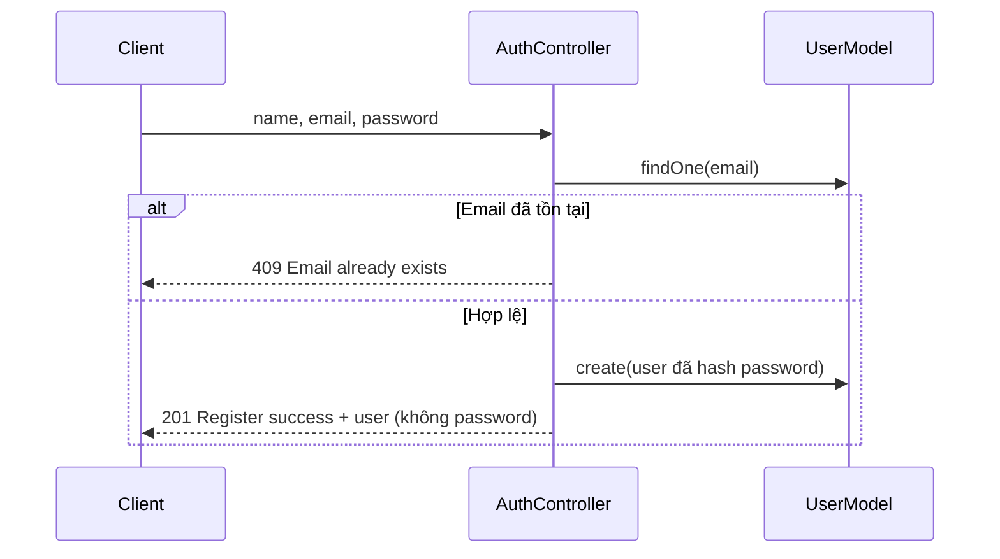
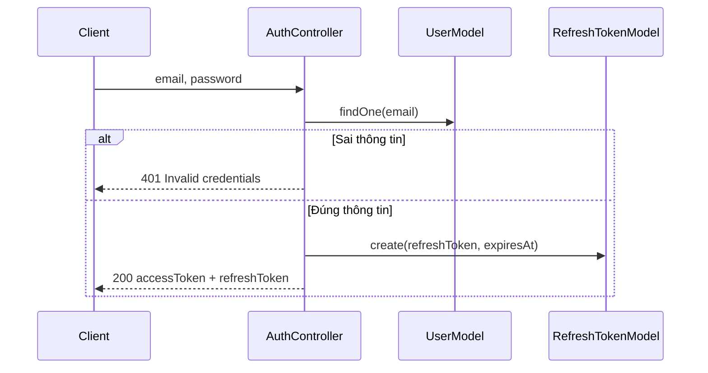
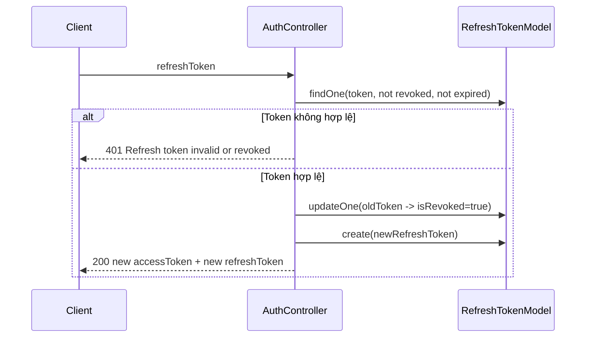
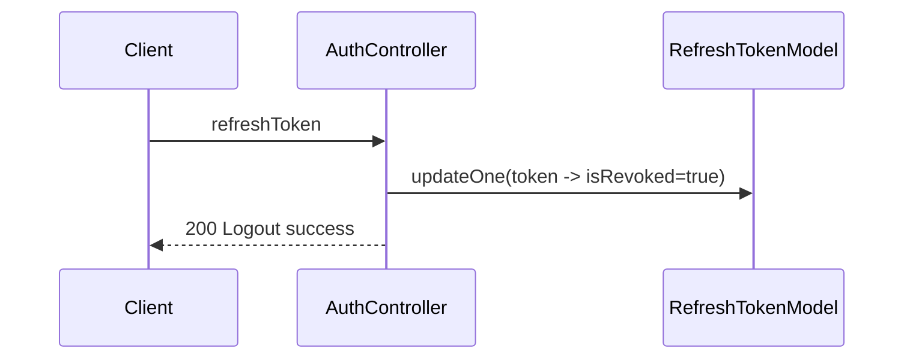
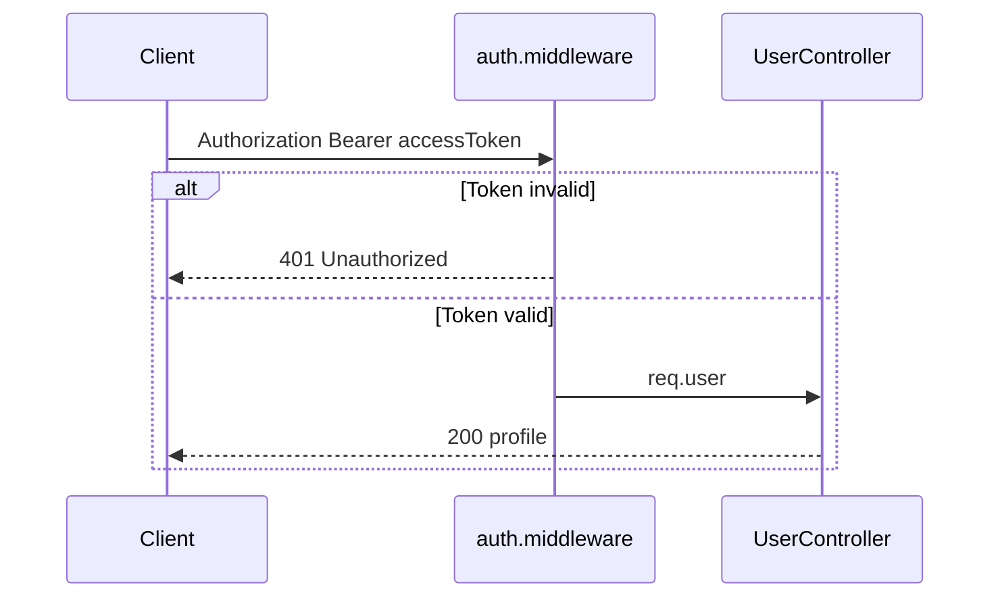
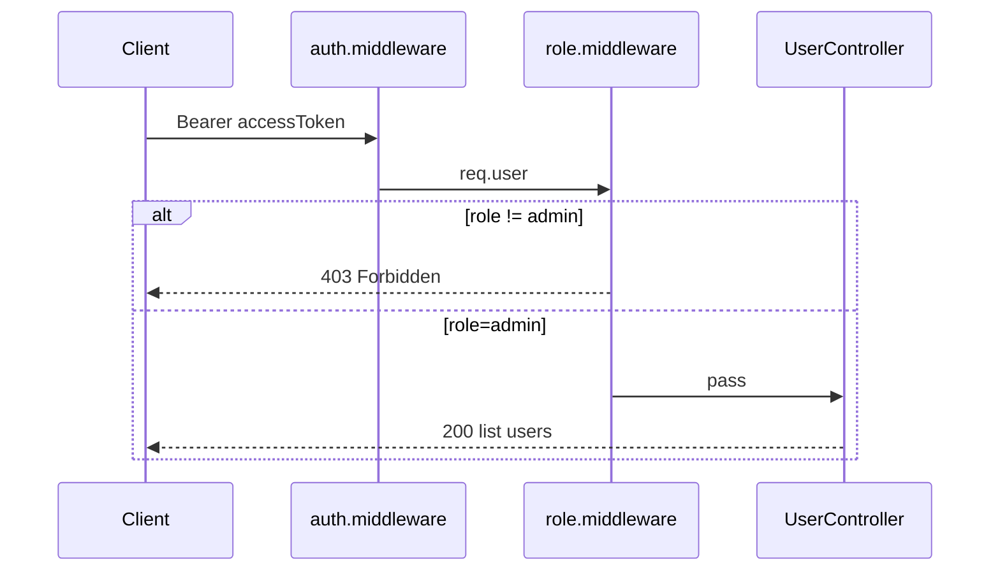
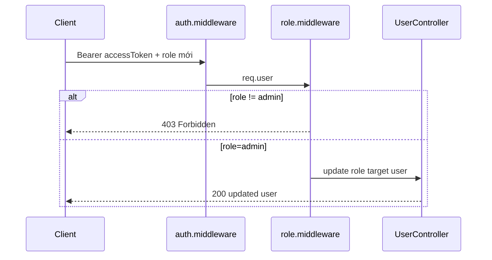
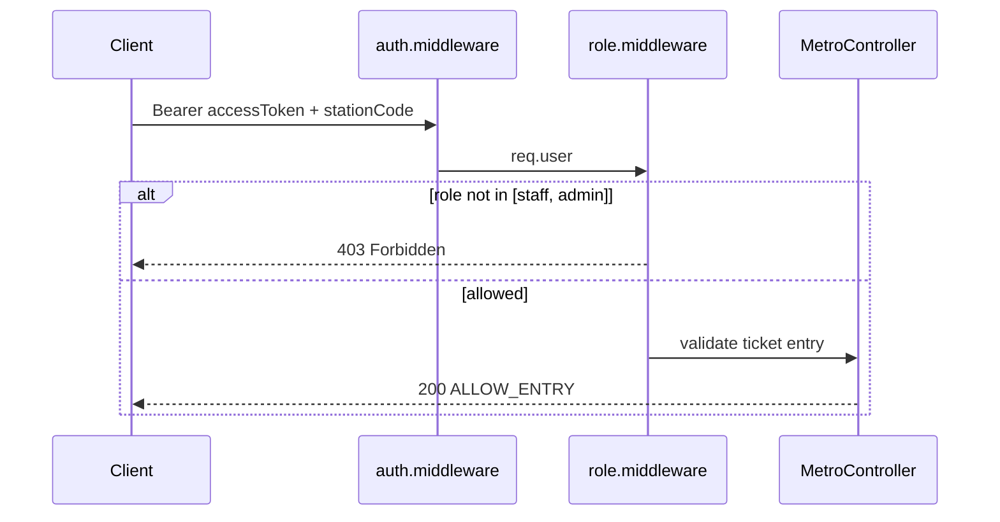
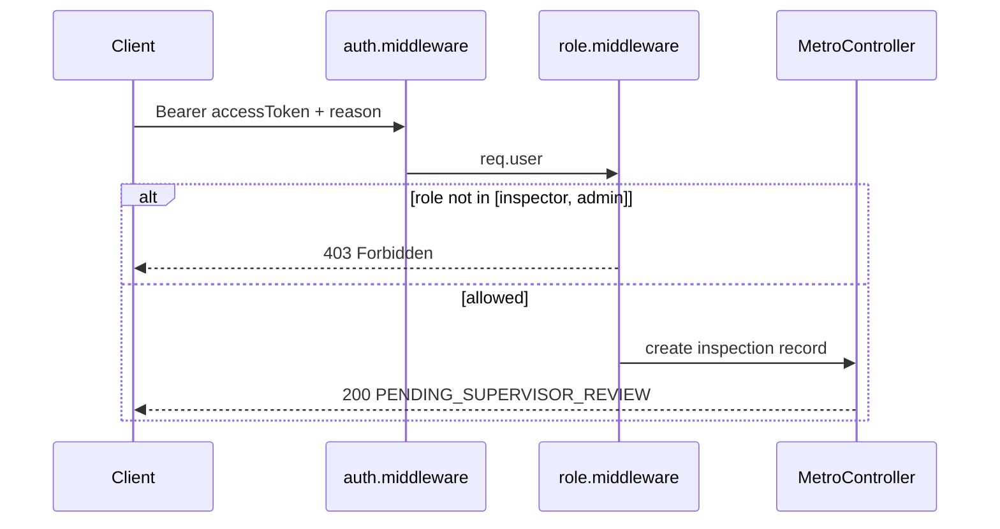

# Bài Tập 4: Auth/Authorize API cho Quản Lý Vé Tàu Điện

## Mục Tiêu

Xây dựng backend Node.js cơ bản cho hệ thống quản lý vé tàu điện, tập trung vào:

- Authentication (đăng ký, đăng nhập, đăng xuất)
- Authorization theo vai trò vận hành
- Refresh token rotation với JWT
- Kết nối MongoDB local (MongoDB Compass)

## Vai Trò Trong Bối Cảnh Vé Tàu Điện

- `passenger`: hành khách
- `staff`: nhân viên ga
- `inspector`: kiểm soát viên vé
- `admin`: quản trị hệ thống


---

## Yêu Cầu Chung

- Sử dụng Node.js + Express
- Kết nối MongoDB local với Mongoose
- Dùng JWT cho access token và refresh token
- Hash password bằng bcrypt
- Tách module: routes, controllers, services, models, middlewares
- Chuẩn hóa response JSON và error handling

---

## Cấu Trúc Thư Mục

```
BaiTap4/
├── baitap4.md
├── package.json
├── .env.example
├── .gitignore
├── src/
│   ├── app.js
│   ├── server.js
│   ├── config/
│   │   └── db.js
│   ├── models/
│   │   ├── user.model.js
│   │   └── refreshToken.model.js
│   ├── controllers/
│   │   ├── auth.controller.js
│   │   ├── user.controller.js
│   │   └── metro.controller.js
│   ├── routes/
│   │   ├── auth.routes.js
│   │   ├── user.routes.js
│   │   └── metro.routes.js
│   ├── middlewares/
│   │   ├── auth.middleware.js
│   │   ├── role.middleware.js
│   │   └── error.middleware.js
│   ├── services/
│   │   └── token.service.js
│   └── utils/
│       ├── apiResponse.js
│       └── appError.js
└── tests/
    └── auth.integration.test.js
```

---

## Model Yêu Cầu

### User (`user.model.js`)

- `email`: string, unique, required
- `password`: string, required
- `name`: string, required
- `role`: enum [`passenger`, `staff`, `inspector`, `admin`] - default `passenger`
- `isActive`: boolean, default `true`
- timestamps

### RefreshToken (`refreshToken.model.js`)

- `userId`: ObjectId, ref `User`
- `token`: string, unique
- `expiresAt`: Date
- `isRevoked`: boolean, default `false`
- timestamps

---

## Danh Sách API

### 1) `POST /api/auth/register`



### 2) `POST /api/auth/login`



### 3) `POST /api/auth/refresh-token`



### 4) `POST /api/auth/logout`



### 5) `GET /api/users/me`



### 6) `GET /api/users` (admin only)



### 7) `PATCH /api/users/:id/role` (admin only)



### 8) `POST /api/metro/tickets/:ticketCode/validate-entry` (staff/admin)



### 9) `POST /api/metro/tickets/:ticketCode/manual-inspection` (inspector/admin)



---

## Bài Tập

### Phần A - Auth cơ bản

- [x] Hoàn thiện register/login/refresh/logout.
- [x] Lưu refresh token trong DB và revoke khi refresh/logout.

### Phần B - Role-based access

- [x] Hoàn thiện middleware `authenticate`.
- [x] Hoàn thiện middleware `authorizeRoles(...roles)`.
- [x] Hoàn thiện 2 chức năng role-check theo nghiệp vụ tàu điện:
  - [x] Kiểm tra vé tại cổng vào ga (`validate-entry`)
  - [x] Lập biên bản kiểm tra thủ công (`manual-inspection`)

### Phần C - Quản trị người dùng

- [x] Admin xem danh sách người dùng.
- [x] Admin cập nhật role tài khoản.

### Trạng thái tổng quan

- [x] Mapping tài liệu và code đã đồng bộ theo bối cảnh vé tàu điện.
- [x] Sơ đồ API đã đổi sang sequence diagram cho từng API.
- [x] Đã có integration test cho auth + role-check (`5/5` pass).
- [ ] Chưa thực hiện manual test đầy đủ bằng Postman/Insomnia (chỉ định nghĩa checklist).

---

## Kiểm Thử

### Manual test checklist

1. [ ] Passenger register + login thành công.
2. [ ] Passenger gọi `/api/users` bị 403.
3. [ ] Staff gọi `validate-entry` thành công.
4. [ ] Passenger gọi `validate-entry` bị 403.
5. [ ] Inspector gọi `manual-inspection` thành công.
6. [ ] Staff gọi `manual-inspection` bị 403.
7. [ ] Refresh token trả về cặp token mới và token cũ không dùng lại được.

### Integration test

- [x] Dùng Jest + Supertest.
- [x] Kết nối DB test local: `mongodb://127.0.0.1:27017/node_auth_test`.
- [x] Test file: `tests/auth.integration.test.js`.
- [x] Kết quả hiện tại: `5/5 tests passed`.

---

## Cài Đặt Nhanh

```bash
cd BaiTap4
npm install
npm run dev
```

Tạo `.env` từ `.env.example`:

```env
PORT=3000
MONGO_URI=mongodb://127.0.0.1:27017/node_auth_db
ACCESS_TOKEN_SECRET=your_access_secret
REFRESH_TOKEN_SECRET=your_refresh_secret
ACCESS_TOKEN_EXPIRES=15m
REFRESH_TOKEN_EXPIRES=7d
NODE_ENV=development
```

---

## Tiêu Chí Đánh Giá

| Tiêu chí                                    | Điểm |
| ------------------------------------------- | ---- |
| Luồng auth + refresh token đúng             | 30%  |
| Role-based access đúng theo nghiệp vụ metro | 30%  |
| Kết nối MongoDB và quản lý token đúng       | 20%  |
| Cấu trúc code rõ ràng, dễ bảo trì           | 10%  |
| Test coverage cho case chính                | 10%  |
