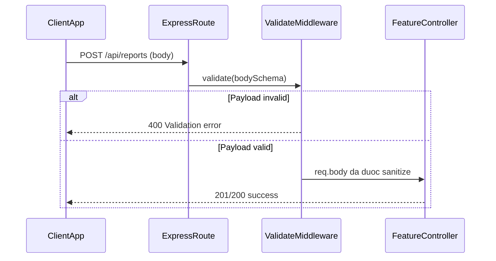
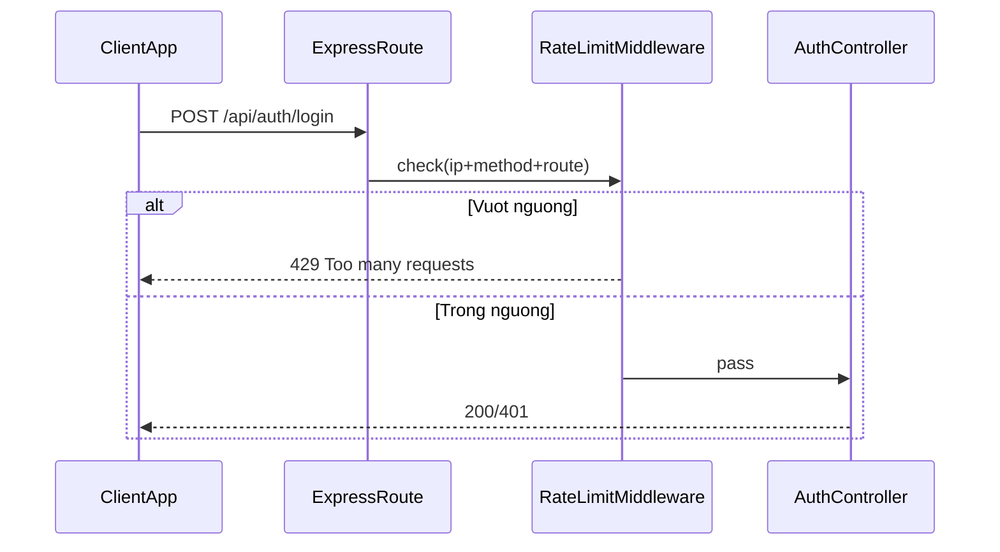
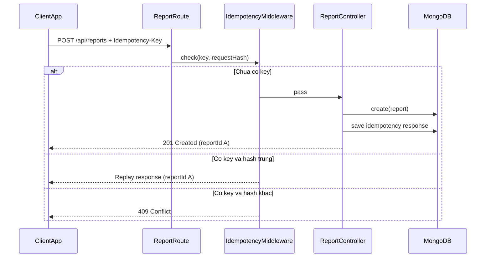
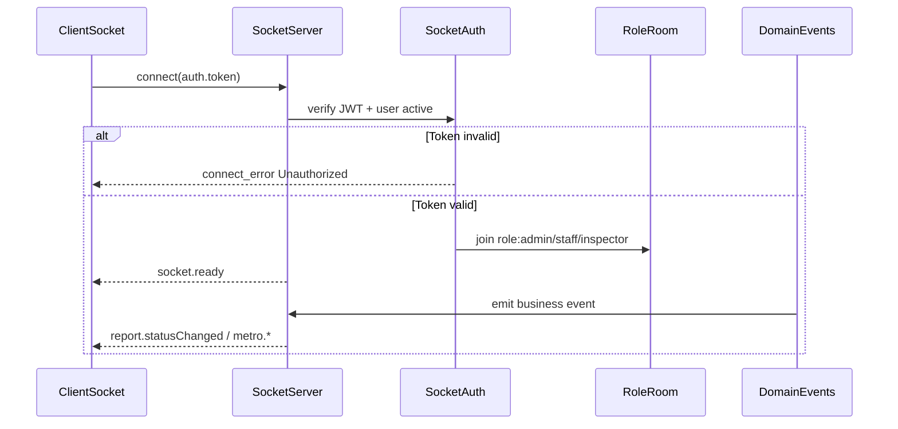
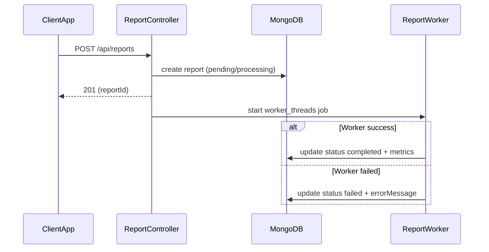
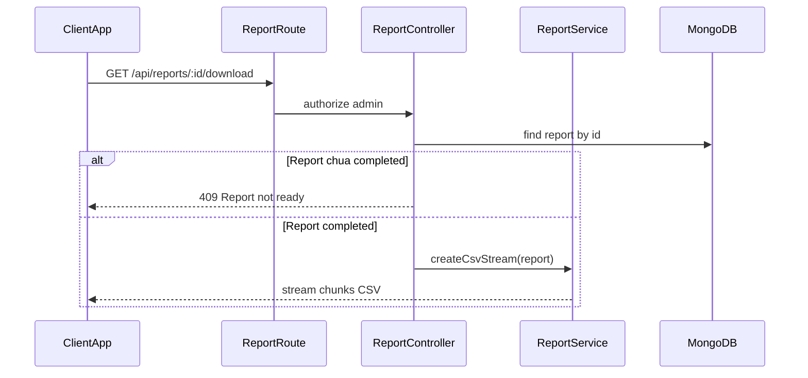
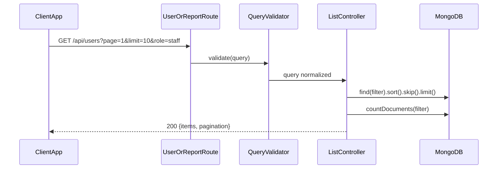

# Bài Tập 5: API nâng cao + Realtime (phiên bản scaffold)

## Mục tiêu

Xây dựng bộ khung mở rộng từ `BaiTap4` để sinh viên hoàn thiện các kỹ thuật Node.js nâng cao:

- Validation schema
- Rate limit
- Idempotency-Key
- Realtime theo vai trò
- Worker thread cho xử lý nặng
- Streaming CSV

Phiên bản hiện tại ưu tiên **khung sườn + yêu cầu bổ sung** để làm bài theo từng bước.

## Phạm vi kiến trúc đã dựng

- Cấu trúc thư mục đầy đủ cho `controllers`, `routes`, `middlewares`, `services`, `models`, `validators`, `events`, `realtime`, `workers`
- Model nền cho report, metro event, idempotency key
- Route đã khai báo cho report API và middleware tương ứng
- Bộ test đã tách theo:
  - `auth.integration.test.js`
  - `advanced.integration.test.js`
  - `realtime.integration.test.js`

## Trạng thái chức năng

### Chức năng đã làm

- Luồng Auth/Authorize nền từ Bài Tập 4 vẫn dùng được
- Validation cơ bản bằng Joi cho các nhóm API
- Rate limit in-memory mức cơ bản
- API users có phân trang/lọc/sắp xếp
- Socket auth cơ bản và sự kiện `socket.ready`
- Luồng metro manual inspection realtime hiện có test pass

### Chức năng đang để scaffold, cần bổ sung

- Idempotency replay đầy đủ:
  - Tính `requestHash`
  - Replay response cũ theo key hợp lệ
  - Trả `409` khi key trùng nhưng payload khác
  - Lưu response vào DB với TTL rõ ràng
- Realtime domain events đầy đủ:
  - Gắn EventEmitter listeners cho report và metro
  - Broadcast theo room role chuẩn
- Report worker flow đầy đủ:
  - Queue worker thread
  - Cập nhật trạng thái `processing/completed/failed`
  - Ghi thống kê thực tế sau xử lý
- CSV streaming đầy đủ:
  - Chỉ cho tải khi report hoàn tất
  - Stream dữ liệu thực thay vì nội dung placeholder

## Yêu cầu code bổ sung

### Idempotency-Key

- Áp dụng chặt cho `POST /api/reports`
- Header bắt buộc: `Idempotency-Key`
- Cùng key + cùng payload phải replay đúng response trước
- Cùng key + payload khác phải trả `409`

### Realtime

- Join room theo role (`admin`, `staff`, `inspector`)
- Emit sự kiện:
  - `metro.ticket.entryValidated`
  - `metro.ticket.manualInspectionCreated`
  - `report.created`
  - `report.statusChanged`

### Worker + report

- Khi tạo report:
  - tạo record ban đầu
  - đẩy xử lý vào worker
  - cập nhật trạng thái khi worker hoàn tất/thất bại
- Không block luồng chính

### CSV download

- Endpoint `GET /api/reports/:id/download`
- Trả stream CSV đúng định dạng
- Từ chối tải khi report chưa `completed`

## Giải thích yêu cầu chức năng

Phần này mô tả chi tiết cách dùng API theo luồng thực tế để dễ implement và dễ đối chiếu test.

### Validation schema

- Mục đích:
  - Chặn dữ liệu sai ngay tại tầng API
  - Tránh lỗi nghiệp vụ phát sinh ở controller/service
- Cần đảm bảo:
  - Validate được cả `body`, `query`, `params` (nếu có)
  - Thông báo lỗi rõ ràng, nhất quán định dạng JSON lỗi
  - Loại bỏ field thừa để giảm rủi ro dữ liệu bẩn
- Kết quả mong đợi:
  - Payload sai luôn trả `400`
  - Payload đúng mới đi tiếp vào business logic



### Rate limit

- Mục đích:
  - Chống spam API và brute-force đăng nhập
- Cần đảm bảo:
  - Giới hạn theo cửa sổ thời gian (`windowMs`) và số lần tối đa (`limit`)
  - Key giới hạn theo `ip + method + route` hoặc key tùy chỉnh
  - Trả thông báo rõ thời gian chờ còn lại khi bị chặn
- Kết quả mong đợi:
  - Vượt ngưỡng trả `429`
  - Không ảnh hưởng request hợp lệ trong ngưỡng



### Idempotency-Key (cho tạo report)

- Mục đích:
  - Tránh tạo trùng report khi client retry hoặc bấm gửi nhiều lần
- Cần đảm bảo:
  - Header `Idempotency-Key` là bắt buộc
  - Có cơ chế hash request để so khớp payload
  - Cùng key + cùng payload: replay đúng response cũ
  - Cùng key + payload khác: trả `409`
  - Có TTL để key hết hạn theo thời gian
- Kết quả mong đợi:
  - API tạo report an toàn khi retry
  - Không sinh trùng dữ liệu trong cùng cửa sổ idempotency

Luồng dùng API nên theo thứ tự:

- Gửi `POST /api/reports` với `Authorization` và `Idempotency-Key`
- Nếu timeout phía client, gửi lại đúng key và đúng body
- Dựa vào phản hồi:
  - `201` + cùng `reportId` => replay đúng
  - `409` => key bị dùng với payload khác



### Realtime theo vai trò

- Mục đích:
  - Đẩy trạng thái nghiệp vụ ngay lập tức tới đúng nhóm người dùng
- Cần đảm bảo:
  - Socket phải xác thực JWT trước khi kết nối
  - User vào đúng room theo role
  - Event phát đúng tên, đúng payload, đúng room nhận
- Kết quả mong đợi:
  - `staff/inspector/admin` chỉ nhận sự kiện liên quan quyền của mình
  - Các sự kiện report/metro cập nhật theo thời gian thực

Luồng dùng realtime:

- Client đăng nhập lấy access token
- Client kết nối Socket.IO bằng token
- Server xác thực JWT, join room theo role
- Khi có nghiệp vụ phát sinh, server emit đúng room



### Worker thread xử lý report

- Mục đích:
  - Tách tác vụ nặng ra khỏi luồng request để tránh block event loop
- Cần đảm bảo:
  - Khi tạo report chỉ trả trạng thái ban đầu (`pending/processing`)
  - Worker xử lý nền, sau đó cập nhật `completed/failed`
  - Có lưu lỗi khi xử lý thất bại
- Kết quả mong đợi:
  - API phản hồi nhanh
  - Report chuyển trạng thái đúng theo vòng đời xử lý



### CSV streaming

- Mục đích:
  - Tải dữ liệu lớn hiệu quả, không load toàn bộ vào RAM
- Cần đảm bảo:
  - Chỉ cho tải khi report đã `completed`
  - Header download đúng (`Content-Type`, `Content-Disposition`)
  - Dữ liệu trả về theo stream, đúng định dạng CSV
- Kết quả mong đợi:
  - Download ổn định cho file lớn
  - Nội dung CSV có đủ các cột thống kê theo yêu cầu



### Pagination, filter, sort

- Mục đích:
  - Tăng khả năng truy vấn dữ liệu linh hoạt cho dashboard/admin
- Cần đảm bảo:
  - Có `page`, `limit`, `sortBy`, `sortOrder`
  - Filter theo trường nghiệp vụ chính (`role`, `status`, `q`)
  - Trả metadata phân trang (`total`, `totalPages`, `page`, `limit`)
- Kết quả mong đợi:
  - API danh sách dễ dùng cho frontend
  - Không cần tải toàn bộ dữ liệu mỗi lần gọi API



## API đã khai báo

- Auth:
  - `POST /api/auth/register`
  - `POST /api/auth/login`
  - `POST /api/auth/refresh-token`
  - `POST /api/auth/logout`
- User:
  - `GET /api/users/me`
  - `GET /api/users`
  - `PATCH /api/users/:id/role`
- Metro:
  - `POST /api/metro/tickets/:ticketCode/validate-entry`
  - `POST /api/metro/tickets/:ticketCode/manual-inspection`
- Report:
  - `POST /api/reports`
  - `GET /api/reports`
  - `GET /api/reports/:id`
  - `GET /api/reports/:id/download`

## Checklist tiến độ

### Checklist code

- [x] Dựng cấu trúc thư mục và module nền
- [x] Gắn route và validator cho API nâng cao
- [x] Khai báo middleware idempotency/rate limit dạng khung
- [x] Khai báo service worker/report dạng khung
- [x] Khai báo realtime socket auth dạng khung
- [ ] Hoàn thiện idempotency replay + conflict detection
- [ ] Hoàn thiện worker flow cập nhật trạng thái report
- [ ] Hoàn thiện emit realtime theo domain events
- [ ] Hoàn thiện CSV streaming dữ liệu thực

### Checklist test hiện tại

- [x] Test auth regression chạy pass
- [x] Test validation/rate-limit/pagination cơ bản chạy pass
- [x] Test realtime nền (`socket.ready`) chạy pass
- [x] Đã chuẩn bị test nâng cao ở dạng `skip` cho phần chưa làm

### Checklist test cần bật lại sau khi làm thêm

- [ ] Bỏ `skip` test idempotency report
- [ ] Bỏ `skip` test report realtime events
- [ ] Bỏ `skip` test manual inspection realtime event
- [ ] Xác nhận test `409 conflict` với payload khác key trùng
- [ ] Xác nhận test replay cùng key cùng payload
- [ ] Xác nhận test download CSV dữ liệu thật sau khi worker hoàn tất

## Test chuẩn bị sẵn để verify phần chưa làm

Các test đã viết sẵn và đang để `skip`:

- `tests/advanced.integration.test.js`
  - `report create supports idempotency and csv download`
  - `report API should reject when missing Idempotency-Key`
- `tests/realtime.integration.test.js`
  - `inspector receives manual inspection realtime event`
  - `admin should receive report realtime events`

Mục tiêu là chỉ cần hoàn thiện code, bỏ `skip` và chạy `npm test` để verify ngay.

## Cài đặt nhanh

```bash
cd BaiTap5
npm install
npm test
npm run dev
```

## Biến môi trường mẫu

```env
PORT=3000
MONGO_URI=mongodb://127.0.0.1:27017/node_auth_db
ACCESS_TOKEN_SECRET=your_access_secret
REFRESH_TOKEN_SECRET=your_refresh_secret
ACCESS_TOKEN_EXPIRES=15m
REFRESH_TOKEN_EXPIRES=7d
NODE_ENV=development
```

## Tài liệu liên quan

- `README.md`: hướng dẫn chạy nhanh
- `idempotency-key-approach.md`: phân tích chi tiết hướng tiếp cận Idempotency-Key
