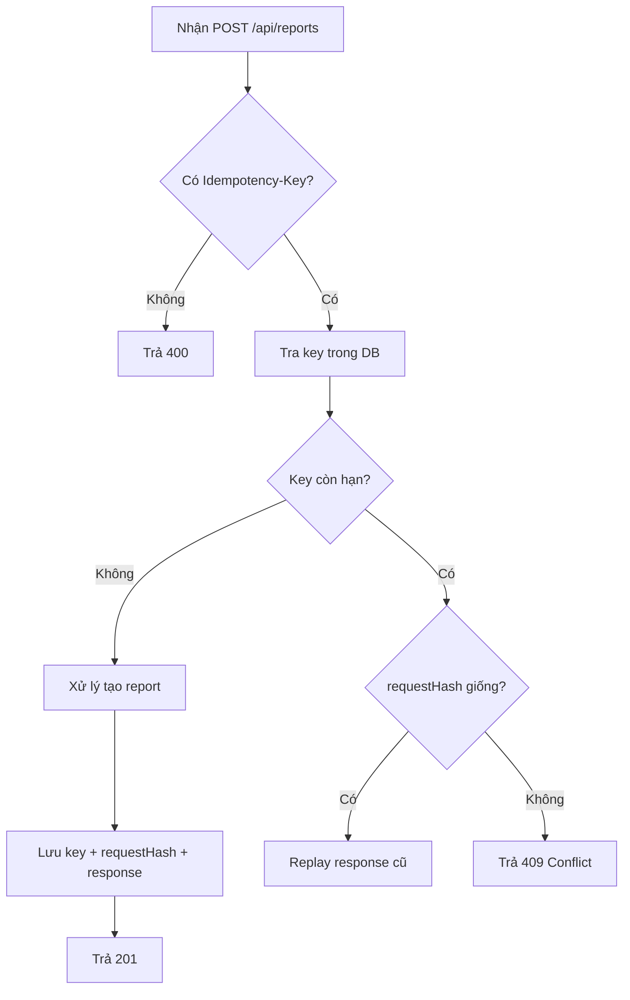

# Idempotency-Key trong Bài Tập 5

## 1) Idempotency-Key là gì?

`Idempotency-Key` là một khóa do client gửi lên để đánh dấu một thao tác tạo dữ liệu.

Mục tiêu: nếu request bị gửi lại nhiều lần (do timeout, retry, người dùng bấm nhiều lần), server vẫn chỉ xử lý **một lần duy nhất** cho cùng một ý định.

Trong Bài Tập 5, khóa này được áp dụng cho endpoint:

- `POST /api/reports`

---

## 2) Vì sao cần trong hệ thống này?

Khi tạo report, quá trình xử lý chạy bất đồng bộ qua worker thread. Nếu không có idempotency:

- Có thể tạo trùng nhiều report giống nhau
- Tăng tải hệ thống không cần thiết
- Dữ liệu khó kiểm soát khi có retry từ client/gateway

Do đó, `Idempotency-Key` giúp API tạo report ổn định hơn trong thực tế.

---

## 3) Quy tắc xử lý trong project

Server xử lý theo 3 tình huống:

1. **Chưa có key trong hệ thống**
   - Cho phép xử lý request
   - Tạo report
   - Lưu lại response kèm key

2. **Đã có key và payload trùng nhau**
   - Không tạo report mới
   - Trả lại chính response đã lưu trước đó (replay)

3. **Đã có key nhưng payload khác**
   - Từ chối request
   - Trả `409 Conflict`

---

## 4) Luồng xử lý tổng quát



---

## 5) Cách triển khai trong code

Các file chính:

- Middleware kiểm tra và replay:
  - `src/middlewares/idempotency.middleware.js`
- Model lưu thông tin idempotency:
  - `src/models/idempotency.model.js`
- Route sử dụng middleware:
  - `src/routes/report.routes.js`
- Controller lưu response sau khi tạo report:
  - `src/controllers/report.controller.js`

Thông tin lưu trong collection idempotency:

- `key`
- `method`
- `path`
- `requestHash` (sha256 của method + path + body)
- `statusCode`
- `responseBody`
- `expiresAt`

TTL hiện tại trong code: 1 giờ.

---

## 6) Ví dụ gọi API đúng chuẩn

```http
POST /api/reports
Authorization: Bearer <admin_access_token>
Idempotency-Key: report-weekly-2026-03-11-001
Content-Type: application/json

{
  "title": "Báo cáo tuần 1 tháng 3",
  "type": "weekly",
  "fromDate": "2026-03-01T00:00:00.000Z",
  "toDate": "2026-03-07T23:59:59.000Z"
}
```

Nếu gửi lại đúng request trên với cùng key, server sẽ trả lại response cũ thay vì tạo report mới.

---

## 7) Ưu điểm của approach hiện tại

- Dễ hiểu, dễ test trong đồ án môn Node.js
- Chặn phần lớn tình huống tạo trùng do retry
- Tích hợp trực tiếp vào middleware nên dễ tái sử dụng cho endpoint khác

---

## 8) Hạn chế và hướng nâng cấp

### Hạn chế hiện tại

- Chưa có cơ chế lock phân tán cho nhiều instance app
- Chưa có metrics riêng theo dõi số lượng replay/conflict
- TTL mới ở mức cơ bản, chưa có chính sách theo loại nghiệp vụ

### Nâng cấp khuyến nghị

- Tạo TTL index MongoDB trên `expiresAt` để tự dọn dữ liệu hết hạn
- Dùng Redis khi hệ thống scale nhiều instance
- Thêm quan sát vận hành:
  - Số request replay
  - Tỷ lệ `409 Conflict`
  - Tỷ lệ request thiếu `Idempotency-Key`

---

## 9) Checklist test riêng cho Idempotency-Key

1. [ ] Gửi `POST /api/reports` với key mới -> `201`
2. [ ] Gửi lại cùng key + cùng body -> vẫn `201`, cùng `reportId`
3. [ ] Gửi lại cùng key + body khác -> `409`
4. [ ] Không gửi header `Idempotency-Key` -> `400`
5. [ ] Sau khi key hết hạn TTL -> request mới được xử lý như key mới
