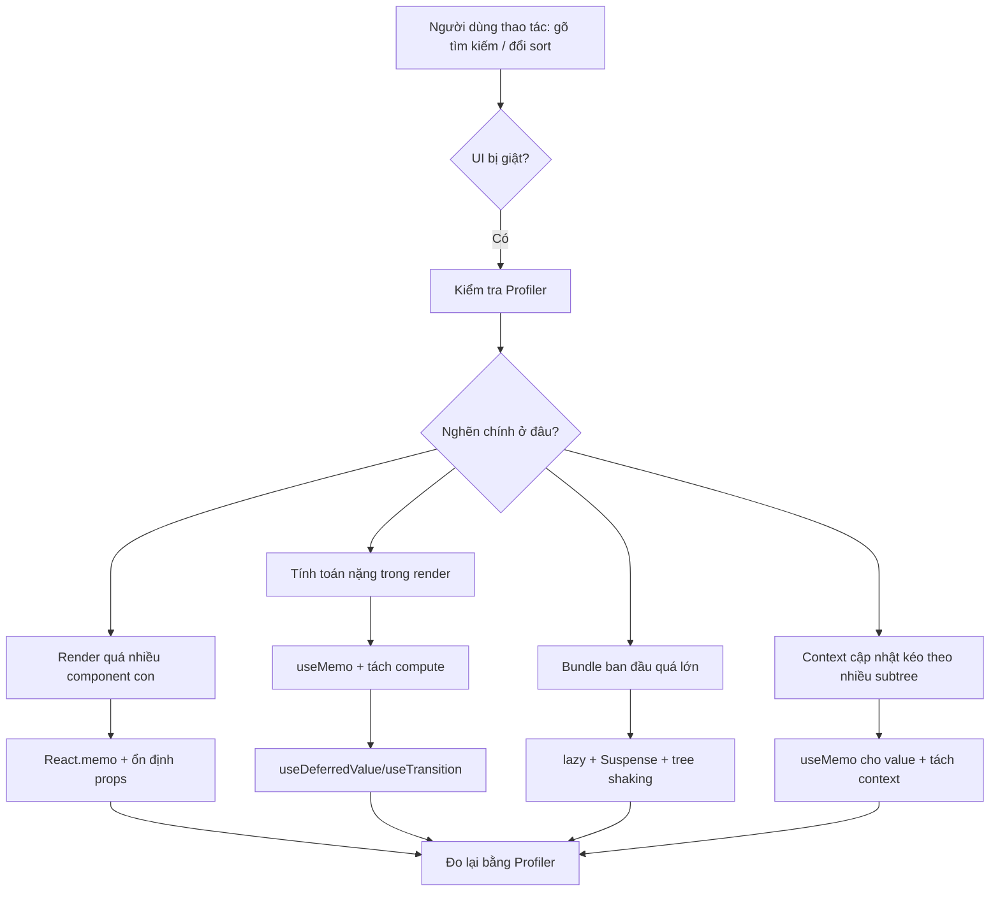
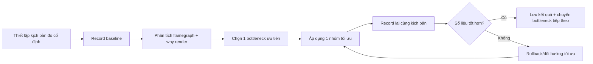
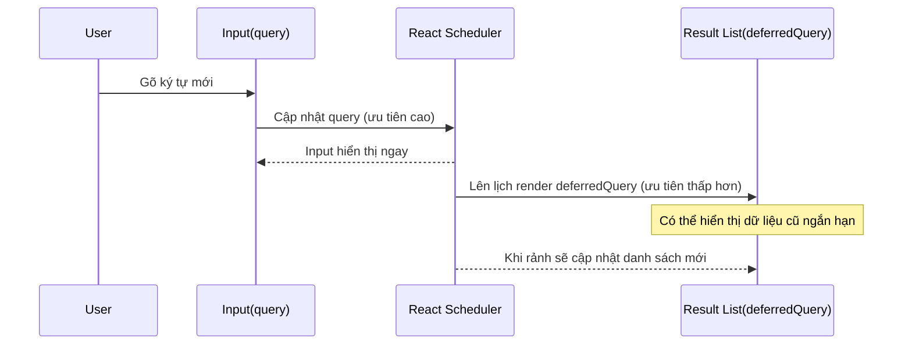
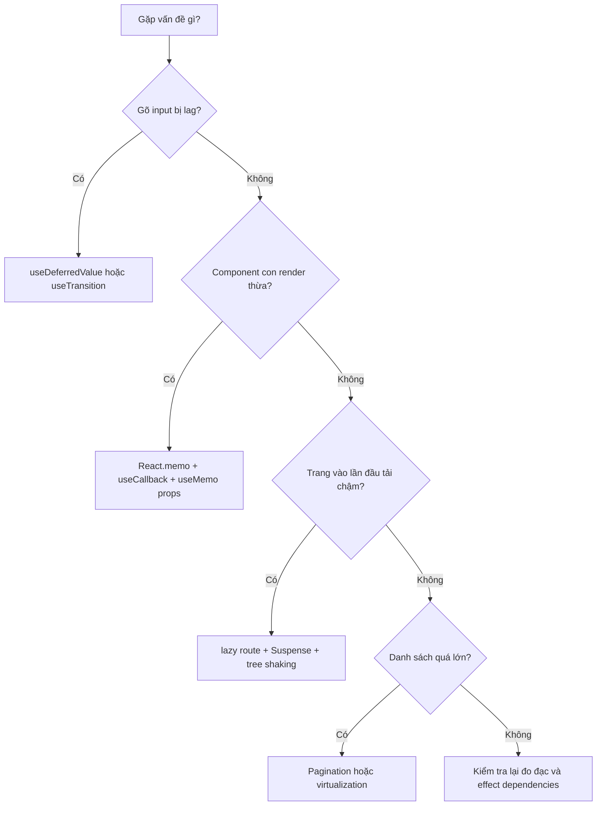

# Bài Tập 7 - React 19 Performance Lab

## Mục tiêu của bài

Trong bài này:

- Biết cách **đo performance có số liệu** thay vì tối ưu theo cảm giác.
- Dùng **React Developer Tools (Profiler + Components)** để tìm đúng điểm nghẽn.
- Tối ưu các vấn đề phổ biến trong React 19:
  - Re-render thừa
  - Tính toán nặng trong lúc render
  - Danh sách lớn gây giật màn hình lúc xem
  - Bundle lúc khởi tạo quá lớn
- Áp dụng đúng bộ kỹ thuật: `React.memo`, `useMemo`, `useCallback`, `useDeferredValue`, code splitting, tree shaking.

---

## Trong BaiTap7

Đã có sẵn:

- Frontend route lab: `http://localhost:5173/performance/lab`
- Backend endpoint tạo dữ liệu lớn:
  - `GET /api/performance/datasets/users?size=1500&delayMs=0`

Ý tưởng: dùng cùng một màn hình để so sánh **trước tối ưu** và **sau tối ưu** (toggle Optimize mode), từ đó quan sát khác biệt ngay trên Profiler.

---

## Những vấn đề performance cần đặc biệt quan tâm

### Sơ đồ tổng quan nguyên nhân gây chậm




### A. Vấn đề tải trang và kích thước bundle

- **Import route theo kiểu eager (nhập ngay từ đầu)**
  - Dấu hiệu: mở app lần đầu thấy tải JS lớn dù chưa vào các trang nặng.
  - Tác hại: tăng thời gian khởi tạo (TTI), đặc biệt trên máy yếu/mạng chậm.
  - Hướng xử lý:
    - Dùng `lazy()` + `Suspense` để tách chunk theo route.
    - Chỉ tải code khi người dùng vào route đó.
- **Tree shaking không hiệu quả**
  - Dấu hiệu: import cả module lớn nhưng chỉ dùng 1-2 hàm.
  - Tác hại: code thừa vẫn lọt vào bundle.
  - Hướng xử lý:
    - Ưu tiên import theo named export cần thiết.
    - Tránh file utility quá lớn chứa nhiều side effects.
    - Giữ module “thuần” (ít side effect) để bundler dễ loại bỏ phần thừa.

> Ghi chú theo Vite: khi dùng dynamic import, Vite tối ưu preload cho async chunk và common chunk để giảm roundtrip mạng.

### B. Vấn đề re-render không cần thiết

- **Tạo object/array mới trong mỗi lần render**
  - Ví dụ điển hình: `menuItems`, `roleColors`, options cho select.
  - Tác hại: prop reference đổi liên tục -> component con re-render theo.
  - Cách xử lý:
    - Đưa constant ra ngoài component nếu không phụ thuộc state.
    - Hoặc dùng `useMemo` nếu có phụ thuộc.
- **Callback bị tạo lại liên tục**
  - Dấu hiệu: truyền inline function xuống list item.
  - Tác hại: `React.memo` ở child bị “vô hiệu” vì prop function luôn mới.
  - Cách xử lý: `useCallback` cho callback truyền xuống component con.
- **Context value thay đổi reference liên tục**
  - Dấu hiệu: Provider tạo object `value` mới mỗi render.
  - Tác hại: toàn bộ subtree dùng context có thể render lại.
  - Cách xử lý:
    - `useMemo` cho context value.
    - Tách nhỏ context theo domain (auth/profile/ui-settings) nếu cần.

### C. Vấn đề danh sách lớn và tính toán nặng

- **Filter/sort nặng chạy lại mỗi lần render**
  - Dấu hiệu: gõ input bị khựng, flamegraph nóng ở component cha.
  - Cách xử lý:
    - Bọc tính toán bằng `useMemo`.
    - Chỉ chạy lại khi dependency thực sự đổi.
- **Input bị giật do tranh chấp ưu tiên render**
  - Dấu hiệu: gõ text nhưng caret bị lag khi list lớn cập nhật đồng thời.
  - Cách xử lý:
    - `useDeferredValue` cho query đưa vào danh sách.
    - Hoặc `useTransition` cho update không cần ưu tiên cao.
- **Render quá nhiều dòng cùng lúc**
  - Dấu hiệu: mở list 1000+ dòng, cuộn/đổi sort chậm rõ.
  - Cách xử lý:
    - Giới hạn số dòng render (limit/pagination).
    - Với list rất lớn: dùng virtualization (`react-window`, `react-virtualized`).

### D. Vấn đề đo đạc sai cách

- **Tối ưu mà không đo trước/sau**
  - Dấu hiệu: thêm `memo` khắp nơi nhưng không biết có hiệu quả hay không.
  - Cách xử lý:
    - Luôn record baseline.
    - So sánh commit duration, số lần render, trải nghiệm nhập liệu trước/sau.

---

## Cài đặt và chạy bài lab

### Chạy backend

```bash
cd BaiTap7/backend
npm install
npm run dev
```

### Chạy frontend

```bash
cd BaiTap7/frontend
npm install
npm run dev
```

### Vào màn hình lab

- Đăng nhập tài khoản `staff` hoặc `admin`
- Truy cập: `http://localhost:5173/performance/lab`

---

## Hướng dẫn React DevTools từng bước

> Chuẩn bị:
>
> - Cài extension React Developer Tools.
> - Mở tab **Profiler**.
> - Bật tùy chọn “Record why each component rendered” (nếu có).

### Sơ đồ quy trình debug chuẩn với Profiler




### Thiết lập kịch bản đo chuẩn

Đặt giá trị cố định:

- `Dataset Size = 2000`
- `Render Rows = 500`
- `Network Delay = 0`

Mục tiêu: luôn đo trên cùng điều kiện để số liệu có ý nghĩa.

### Đo baseline (trước tối ưu)

- Tắt `Optimize mode`.
- Bấm `Load Dataset`.
- Trong Profiler, bấm Record rồi thực hiện:
  - gõ nhanh 8-12 ký tự vào ô Search
  - đổi `Sort by` 2 lần
  - bật/tắt `Only active users`
- Dừng Record.

Ghi lại:

- `Avg commit duration`
- `Max commit duration`
- Component tốn thời gian nhất (flamegraph nóng nhất)
- “Why did this render?” của các component chính

### Xác định nghẽn ở đâu

Phân tích trong Profiler:

- Nếu `PerformanceLab` chiếm nhiều thời gian:
  - Thường do filter/sort nặng chạy lại quá thường xuyên.
- Nếu hàng trăm row render lại:
  - Thường do prop đổi reference hoặc list render trực tiếp không memo.

### Áp dụng tối ưu và đo lại

- Bật `Optimize mode`.
- Record lại đúng thao tác ở bước đo baseline.
- So sánh 2 lần đo.

Kỳ vọng đúng:

- Input mượt hơn khi gõ nhanh.
- Commit duration giảm đáng kể.
- Số row render lại giảm.

### Đọc kết quả “đúng bản chất”

- `useDeferredValue` **không làm giảm request mạng tự động**.
  - Nó ưu tiên UI responsive, còn request cần debounce/throttle riêng nếu cần.
- `React.memo` chỉ hiệu quả khi props “ổn định”.
  - Nếu truyền object/function mới mỗi render, memo gần như không có tác dụng.

### Sơ đồ quan hệ giữa `query` và `deferredQuery`




### Kiểm chứng optimization ở mức bundle

Chạy build frontend:

```bash
npm run build
```

Sau đó kiểm tra:

- Chunk có tách theo route chưa?
- Route `/performance/lab` có được tải lazy không?
- Kích thước bundle vào app lần đầu có giảm không?

---

## Ví dụ trước/sau

### Ví dụ: Tránh tính toán nặng lặp lại

**Chưa tối ưu (không nên):**

```jsx
const rows = heavyFilterAndSort(users, query, onlyActive, sortBy)
```

**Tối ưu:**

```jsx
const deferredQuery = useDeferredValue(query)
const rows = useMemo(() => {
  return heavyFilterAndSort(users, deferredQuery, onlyActive, sortBy)
}, [users, deferredQuery, onlyActive, sortBy])
```

Ý nghĩa:

- Input cập nhật ngay theo `query`.
- List cập nhật theo `deferredQuery` với độ ưu tiên thấp hơn -> cảm giác gõ mượt.

### Ví dụ: Row component và `React.memo`

**Chưa tối ưu:**

- Viết trực tiếp `<tr>` trong `.map()` của component cha.
- Mỗi lần cha re-render, nhiều row cũng re-render.

**Tối ưu:**

```jsx
const UserRow = memo(function UserRow({ user }) {
  return <tr>{/* ... */}</tr>
})
```

Kết hợp thêm:

- Tránh truyền callback/object mới không cần thiết.
- Nếu phải truyền callback, dùng `useCallback`.

### Ví dụ: Tối ưu context value

**Chưa tối ưu:**

```jsx
const value = { user, isAuthenticated, login, logout }
return <AuthContext.Provider value={value}>{children}</AuthContext.Provider>
```

**Tối ưu:**

```jsx
const value = useMemo(
  () => ({ user, isAuthenticated, login, logout }),
  [user, isAuthenticated, login, logout]
)
```

---

## Bài tập thực hành nâng cao

### Sơ đồ chọn kỹ thuật tối ưu phù hợp




### Bài A - Debounce + Deferred kết hợp

Mục tiêu:

- Vừa giảm số lần render nặng (`useDeferredValue`)
- Vừa giảm số request API (`debounce` 250-300ms)

Tiêu chí đạt:

- Gõ nhanh không giật.
- Request không bắn theo từng ký tự.

### Bài B - Thử virtualization

Mục tiêu:

- Dataset `4000-8000`, render rows lớn.
- So sánh map thường vs virtualization.

Tiêu chí đạt:

- Scroll mượt hơn.
- Commit duration ổn định hơn khi dữ liệu lớn.

### Bài C - Route-level code splitting đầy đủ

Mục tiêu:

- Chuyển các page nặng sang `lazy()`.
- Bọc route bằng `Suspense` fallback hợp lý.

Tiêu chí đạt:

- Tải lần đầu nhanh hơn.
- Trang chưa truy cập chưa bị tải code.

---

## Nộp bài

Mẫu file word:

- **Môi trường test**
  - Dataset size:
  - Render rows:
  - Thiết bị:
- **Baseline**
  - Avg commit:
  - Max commit:
  - Bottleneck chính:
- **Các thay đổi đã làm**
  - Thay đổi 1:
  - Thay đổi 2:
  - Thay đổi 3:
- **Kết quả sau tối ưu**
  - Avg commit:
  - Max commit:
  - Cảm nhận UX khi gõ:
- **Kết luận**
  - Fix hiệu quả nhất:
  - Rủi ro/cần cải thiện thêm:

---

## Tham khảo chính thống

- React `memo`: [https://react.dev/reference/react/memo](https://react.dev/reference/react/memo)
- React `useDeferredValue`: [https://react.dev/reference/react/useDeferredValue](https://react.dev/reference/react/useDeferredValue)
- Vite features/build optimization:
  - [https://vite.dev/guide/features.html](https://vite.dev/guide/features.html)

Ghi chú quan trọng từ tài liệu:

- `memo` là **tối ưu hiệu năng**, không phải “đảm bảo không render”.
- `useDeferredValue` giúp UI phản hồi tốt hơn, **không tự debounce network**.
- Vite tự tối ưu preload cho async/common chunks trong build, hỗ trợ giảm roundtrip tải chunk.

